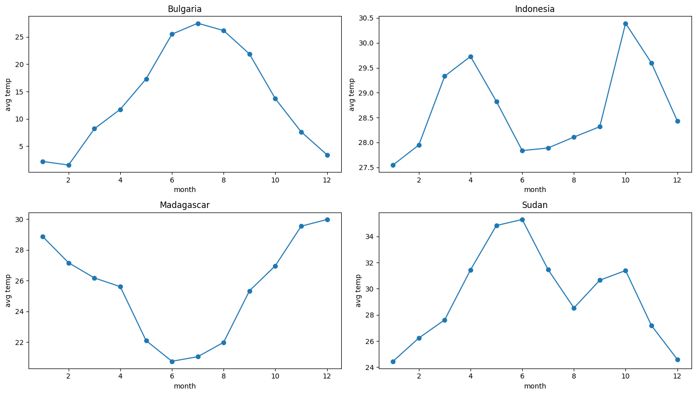
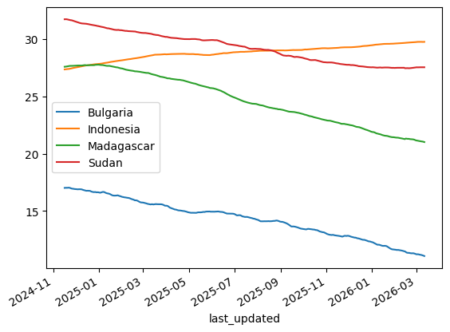
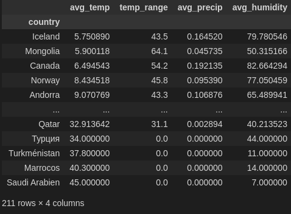
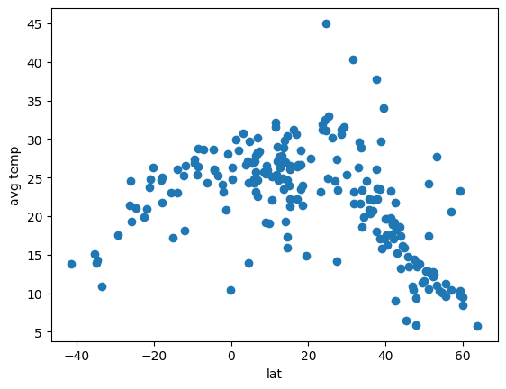
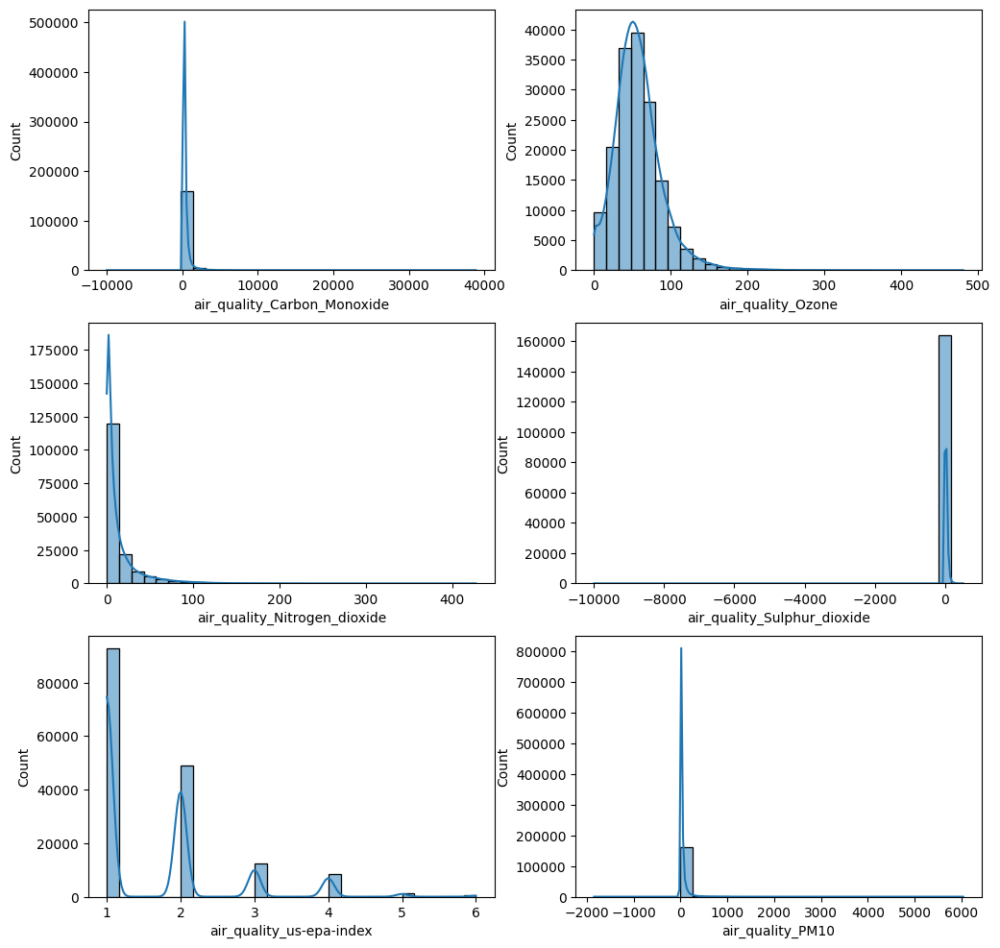
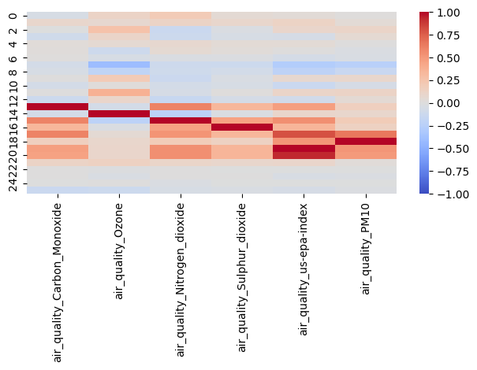
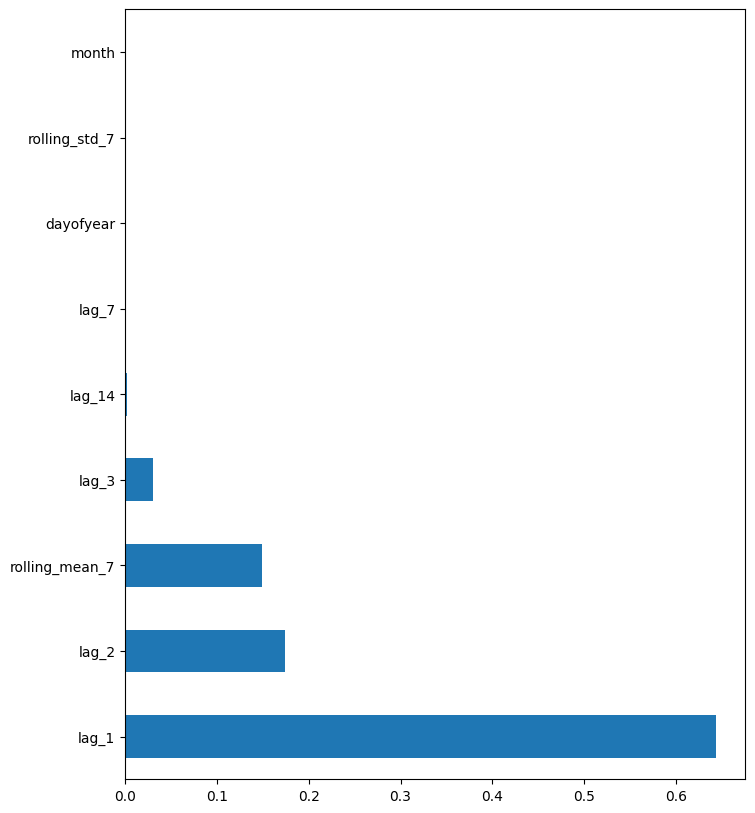
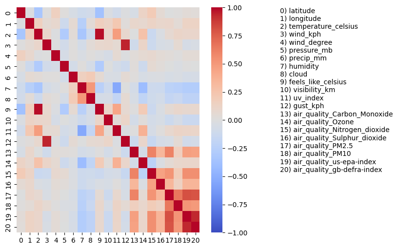
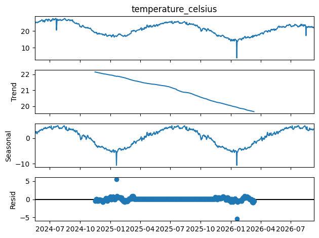

# Analysis report

## 1. Data cleaning

- Found no missing values (`df.isna().sum().sum() == 0`)
- Dropped redundant columns: duplicates (`location_name`, `timezone`, `last_updated_epoch`), units-related duplicates (`temperature_fahrenheit`, `wind_mph`, `pressure_in`, `precip_in`, `feels_like_fahrenheit`, `visibility_miles`, `gust_mph`), and useless columns (`sunrise`, `sunset`, `moonrise`, `moonset`, `moon_phase`, `moon_illumination`, `wind_direction`)
- Converted `last_updated` to `datetime`, set as the index, and derived `hour`, `day`, `month`, `dayofweek`, `year`

## 2 Unique analyses (`analysis.ipynb`)

### a) Climate analysis
- Plotted monthly average temperature for 4 countries with different climates (Bulgaria, Indonesia, Madagascar, Sudan), compared their trend components (via `seasonal_decompose`)
  
  

- Made a summary table (`avg_temp`, `temp_range`, `avg_precip`, `avg_humidity`) sorted by average temperature
  

- Plotted average latitude vs average temperature
  

### b) Environmental impact
- Plotted distributions of 6 air quality features (CO, Ozone, NO2, SO2, US EPA index, PM10)
  
- Discovered their correlations with weather parameters: **Ozone** correlates with temperature, humidity (negative), cloud cover (negative), and UV index; **US EPA index** and **PM10** correlate negatively (weaker) with humidity and cloud cover
  

### c) Feature importance
1. **Correlation coefficients** against `temperature_celsius`, besides `feels_like_celsius` (0.98), most correlated features are `uv_index` (0.48), `humidity` (-0.34), `latitude` (-0.34), `pressure_mb` (-0.29)

2. **Mean Decrease in Impurity (MDI)** from the trained random forest forecasting model (`src/models/model.pkl`), using the lag, rolling, calendar features 

  

## 3. Forecasting models (`train.ipynb`)

- Resampled by day (`resample('D').mean()`) for the whole dataset, derived:
  - **Lag features**: `lag_1, lag_2, lag_3, lag_7, lag_14` (past temperature values)
  - **Rolling stats**: `rolling_mean_7`, `rolling_std_7` (computed from `shift(1)`, so no same day leakage)
  - **Calendar features**: `month`, `dayofyear`
- Split **chronologically** (80/20, without shuffling)

| Model | MAE | RMSE |
|---|---|---|
| Baseline (predict mean) | 1.61 | 1.79 |
| Linear Regression | 0.33 | 0.59 |
| Lasso (α=1.0) | 0.51 | 0.72 |
| Decision Tree (`max_depth=15`) | 0.50 | 0.78 |
| K-Nearest Neighbors (`n=5`) | 0.65 | 1.00 |
| Random Forest (tuned via `RandomizedSearchCV`) | 0.34 | 0.65 |

- Saved the best random forest model to `src/models/model.pkl` and used later in `analysis.ipynb` for feature importance

- Linear Regression and the tuned Random Forest are the top performers, so the lag/seasonal dependency is close to linear

## 4. Insights
**Parameters correlations**

- wind speed - gust speed
- humidity - UV index (negative) 
- temperature - UV index
- air quality metrics

  

**Seasonality**
- Daily temperature follows an annual seasonal cycle with a slight downward trend over the 2-year window (from decomposition)
- 2 anomalies were found: an unusually warm **2025-01-19** (+5.5°C) and unusually cold **2026-01-19** (-5.4°C)

  

**Climate analysis**
- Bulgaria and Madagascar show strong temperature swings throughout the year, while Indonesia and Sudan stay relatively flat, which is explained by tropical and temperate climates respectively

**Forecasting model**
- lag + rolling-stat + calendar features provide better prediction accuracy than a same moment regression problem would do (MAE = 0.33-0.65°C vs 1.61°C naive baseline)
- Linear Regression and the tuned Random Forest are the top models (MAE 0.33–0.34), so the lag/seasonal relationship is close to linear
- Scaling fixed KNN (MAE 1.96 -> 0.65) but worsened Lasso (0.34 → 0.51)
